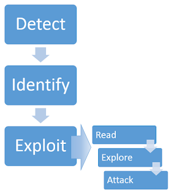

# SSTI1

**Author:** Venax

## Description

I made a cool website where you can announce whatever you want! Try it out!

I heard templating is a cool and modular way to build web apps! Check out my website here!

**Hints:** Server Side Template Injection

# SSTI1

**Author:** Venax

## Description

I made a cool website where you can announce whatever you want! Try it out!

I heard templating is a cool and modular way to build web apps! Check out my website here!

**Hints:** Server Side Template Injection

## What is SSTI?

Server Side Template Injection (SSTI) is a vulnerability that occurs when user input is embedded into a template engine in an unsafe way. Instead of treating the input as plain text, the server **executes it as code**, which can allow an attacker to:

- Read sensitive files on the server
- Execute arbitrary commands
- Gain full control of the server in some cases

Common template engines vulnerable to SSTI include **Jinja2** (Python), **Twig** (PHP), and **Freemarker** (Java).

## Solution

Detect The SSTI vulnerability.
The payload I used to Identify if there is SSTI vulnerability potential is {{7*7}}

Identify The Terminal Engine:

https://portswigger.net/web-security/server-side-template-injection#constructing-a-server-side-template-injection-attack

## Flag

(put the flag here)
